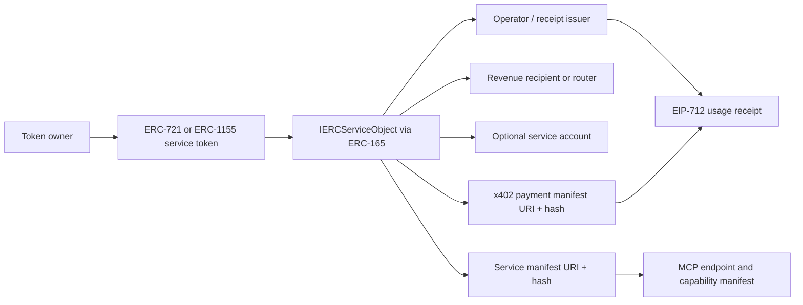
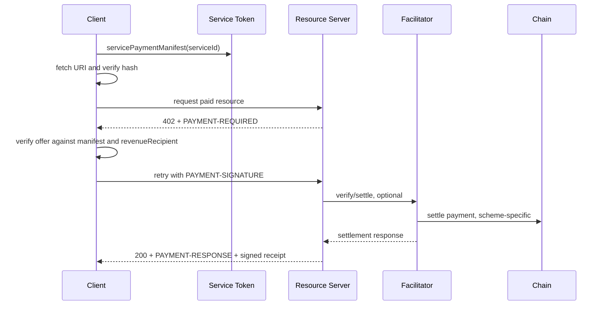
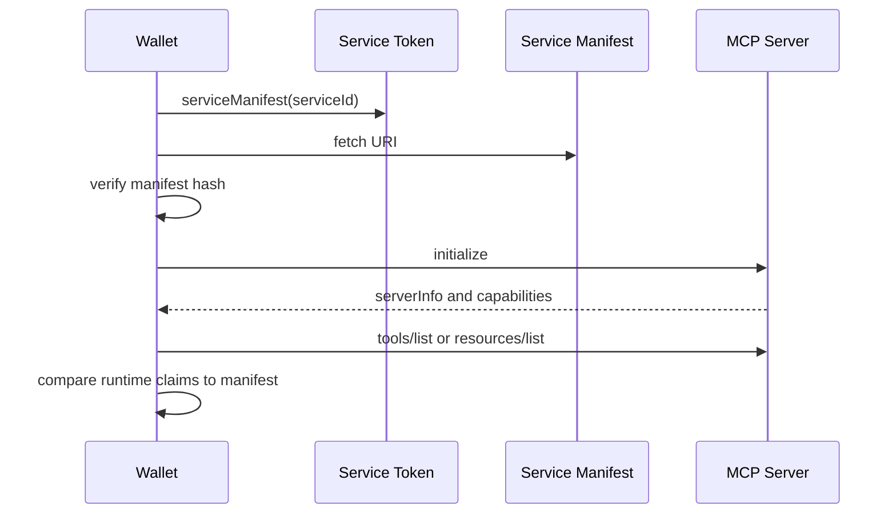

# Protocol Architecture

## Core Model

## x402 Payment Flow

The live x402 offer remains the price quote. The onchain payment manifest is the authorization envelope.

## MCP Service Discovery Flow

Runtime MCP discovery stays authoritative because tools can be dynamic. The manifest is a preflight commitment and provenance record.

## Minimal Viable Standard Surface

Core:

- service account discovery
- service operator discovery with expiry
- revenue recipient discovery
- service manifest URI/hash
- payment manifest URI/hash/route nonce
- receipt issuer authorization
- EIP-712 receipt hash and verification
- optional receipt anchoring event

Optional extensions:

- ERC-6551 account binding details
- lease and encumbrance reporting
- revenue splitting metadata
- onchain receipt checkpoints
- ERC-7579/ERC-6900 module policy profiles
- validation/reputation adapters

