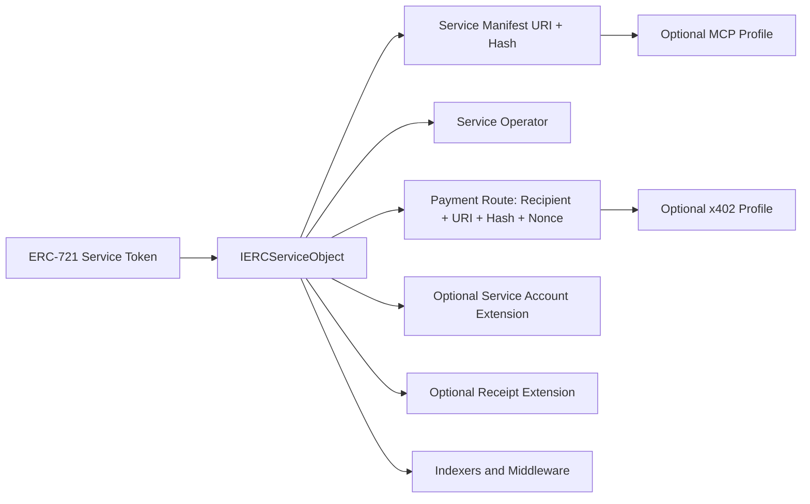

# Final ERC-Candidate Hardening Review

## 1. ERC Scope Reduction Report

Blunt assessment: the current package is credible engineering, but the current core interface is still too broad for first ERC review. It combines four surfaces:

- service metadata
- operator and revenue route discovery
- receipt signing and verification
- controller/admin mutation functions

That is too much to defend at once. The first public draft should define the smallest thing that other systems can actually consume: service manifest, operator, and payment route.

### Function-by-function verdict

| Current item | Verdict | Reason |
| --- | --- | --- |
| `serviceManifest(uint256)` | Keep in core | This is the root interoperability primitive. Without a URI/hash pair, the ERC is only a role registry. |
| `servicePaymentManifest(uint256)` | Keep but rename to `servicePaymentRoute(uint256)` | The route is more than a manifest. Clients need recipient, URI/hash, and nonce together. Current name hides the revenue recipient. |
| `serviceRevenueRecipient(uint256)` | Merge into payment route | A standalone getter creates drift between recipient and manifest. Payment route should be atomically queried. |
| `serviceOperator(uint256)` | Keep in core | Operator discovery is the one role that is not covered by ERC-721 approvals and is needed for endpoint provenance. |
| `serviceAccount(uint256)` | Move to optional extension | Duplicates ERC-6551 and smart account discovery. Useful, not inevitable. |
| `isAuthorizedReceiptIssuer(uint256,address)` | Move to receipt extension | Receipt issuer discovery matters only if receipts are implemented. |
| `hashServiceReceipt(...)` | Move to receipt extension | Good API, wrong layer for base. |
| `verifyServiceReceipt(...)` | Move to receipt extension and rename semantics | Current-state verification invalidates historical receipts after route changes. A base ERC should not bake in that semantic. |
| `setServiceAccount(...)` | Remove from ERC draft | Admin flows are implementation-specific. |
| `setServiceOperator(...)` | Remove from ERC draft | Standardize event and getter, not the authorization path. |
| `setServiceRevenueRecipient(...)` | Remove from ERC draft | Standardize route result and event, not mutation. |
| `setServiceManifest(...)` | Remove from ERC draft | Same reason. |
| `setServicePaymentManifest(...)` | Remove from ERC draft | Same reason. |
| `setServiceReceiptIssuer(...)` | Move to optional receipt extension or reference only | Receipt authority is not base service discovery. |
| `anchorServiceReceipt(...)` | Move to optional receipt anchoring extension | Onchain receipt storage is expensive and not needed for most usage. |

### Event-by-event verdict

| Current event | Verdict | Reason |
| --- | --- | --- |
| `ServiceManifestUpdated` | Keep | Indexers need this. |
| `ServicePaymentManifestUpdated` | Replace with `ServicePaymentRouteUpdated` | Needs recipient and nonce in one event. |
| `ServiceRevenueRecipientUpdated` | Remove if route event exists | Separate event increases state reconstruction burden. |
| `ServiceOperatorUpdated` | Keep | Indexers need operator history. |
| `ServiceAccountUpdated` | Optional extension | Useful only for account-binding profile. |
| `ServiceReceiptIssuerUpdated` | Receipt extension | Not base. |
| `ServiceReceiptAnchored` | Optional receipt anchoring extension | Not base. |

### Schema verdict

| Schema | Verdict | Reason |
| --- | --- | --- |
| Service manifest schema | Keep as informative, not normative JSON Schema | A strict schema will go stale. The ERC should require fields, not own all service metadata. |
| x402 payment manifest schema | Keep as x402 profile, not ERC core | Do not put x402 in `requires`. |
| Capability manifest schema | Move out of ERC submission or appendix | MCP capability shape is not stable enough for base ERC. |
| Service receipt schema | Move to receipt extension | Valuable, but too much for base. |

### What ERC editors are likely to reject

- Mandatory receipt support in the core.
- Mandatory ERC-1155 support without a clear single owner.
- Controller/admin functions as standardized ABI.
- Normative MCP schemas.
- Normative x402 schema details.
- Any language implying service quality, trust, uptime, or economic rights.
- Any attempt to standardize "autonomous" as a legal or operational category.

## 2. Overlap And Collision Report

### ERC-721

ERC-721 already defines non-fungible ownership, transfer, approvals, and metadata. The candidate must not redefine ownership. It should say: for ERC-721 implementations, `serviceId` is the ERC-721 `tokenId`, and `ownerOf(serviceId)` is the service owner.

Risk: ERC-721 already has "operator" language for approvals. The draft's `operator` will confuse reviewers unless renamed or carefully scoped. Best term: `serviceOperator`.

Source: [ERC-721](https://eips.ethereum.org/EIPS/eip-721).

### ERC-1155

ERC-1155 has balances, not a canonical owner. Multi-holder service ownership is ambiguous. Do not include ERC-1155 in the base ERC. Add an optional "ERC-1155 singleton service profile" later.

Source: [ERC-1155](https://eips.ethereum.org/EIPS/eip-1155).

### ERC-6551

`serviceAccount` overlaps directly. ERC-6551 already defines deterministic token-bound accounts. The base ERC should not require or privilege any service account. Put service account discovery in an optional extension and state that ERC-6551 is the preferred deterministic account profile for ERC-721 service tokens.

Source: [ERC-6551](https://eips.ethereum.org/EIPS/eip-6551).

### ERC-7656

This is the dangerous collision. ERC-7656 already defines generalized contract-linked services through a factory and linked service interface. Reviewers will ask why this proposal is not simply an ERC-7656 service implementation.

Answer: ERC-7656 standardizes deployment and linking of service contracts. It does not standardize the service semantics needed by paid endpoint clients: operator, payment route, manifest hash, route nonce, and receipts. This proposal should not be an ERC-7656 extension, but it should be implementable either directly by an ERC-721 contract or by an ERC-7656-linked service contract.

Required wording: "This ERC defines service object semantics. ERC-7656 is a compatible deployment and linking mechanism."

Source: [ERC-7656](https://eips.ethereum.org/EIPS/eip-7656).

### ERC-8004

ERC-8004 defines agent identity, reputation, and validation registries. It explicitly leaves payments orthogonal. This proposal should not claim agent discovery or trust. It should say ERC-8004 agents may reference service objects, and service receipts may feed reputation or validation systems.

Source: [ERC-8004](https://eips.ethereum.org/EIPS/eip-8004).

### ERC-8183

ERC-8183 is job escrow and evaluator attestation. This proposal is a standing service route and receipt interface. Do not mention escrow as a core use case.

Source: [ERC-8183](https://eips.ethereum.org/EIPS/eip-8183).

### ERC-8196

ERC-8196 concerns authenticated AI agent wallets. Do not define wallet policy or agent authentication. Service accounts may use ERC-8196-style wallets, but this ERC should not depend on them.

Source: [ERC-8196](https://eips.ethereum.org/EIPS/eip-8196).

### ERC-4337, ERC-7579, ERC-6900

These standards cover account abstraction and modular account behavior. The candidate must not define session keys, modules, execution modes, account plugin manifests, or paymaster behavior. Any service account integration must be optional.

Sources: [ERC-4337](https://eips.ethereum.org/EIPS/eip-4337), [ERC-7579](https://eips.ethereum.org/EIPS/eip-7579), [ERC-6900](https://eips.ethereum.org/EIPS/eip-6900).

### EIP-712 and ERC-1271

Receipts should use EIP-712 and ERC-1271, but EIP-712 explicitly does not itself include replay protection. The ERC must specify nonce or route/epoch replay boundaries if receipts are normative.

Sources: [EIP-712](https://eips.ethereum.org/EIPS/eip-712), [ERC-1271](https://eips.ethereum.org/EIPS/eip-1271).

### Standalone or extension?

Recommended status: standalone ERC-165 interface, but framed as an ERC-721 service object extension.

Not recommended:

- ERC-7656 extension only: excludes direct token implementations and existing marketplaces.
- Registry standard: duplicates ERC-8004 and ERC-8122 direction.
- Metadata-only standard: does not solve payment-route or operator discovery.
- ERC-1155 base: ownership ambiguity.

## 3. Adoption Feasibility Report

### OpenSea and marketplaces

They will ignore the custom service interface. They will support:

- ERC-721 transfer and approval behavior
- `tokenURI`
- ordinary metadata JSON
- source-verified ABI if someone builds a custom integration
- ERC-4906 metadata updates, if supported by their indexing pipeline

They will not natively render operator, route nonce, receipt issuer, or x402 fields without demand. The standard must work when marketplaces treat the asset as a normal NFT.

Blocker: if transfer invalidates the payment route, buyers receive a "service shell" until reconfigured. That is safer, but marketplaces must show it. Otherwise buyers will think they bought a working endpoint.

### Wallets

Wallets will not implement service UX for a draft ERC. They may display EIP-712 receipt signing fields if typed data is clean. They will not fetch MCP manifests or x402 manifests.

Wallet support requires:

- short, stable typed-data fields
- no dynamic arrays in receipt types
- no "AI" language in signing prompts
- SDK code that turns route data into human-readable warnings

### Indexers

Indexers will support events if the contract is verified and the ABI is stable. They prefer fewer events with complete route state.

Adoption blocker: current split `RevenueRecipientUpdated` plus `PaymentManifestUpdated` can create ambiguous reconstruction. Use one `ServicePaymentRouteUpdated` event.

### Base ecosystem

Base is likely the best first chain because x402 and USDC payment flows are active there. Base will care about:

- low-gas updates
- clear CAIP-2 chain IDs in offchain manifests
- no Base-specific normative assumptions
- easy viem examples

### Smart account ecosystem

Safe and ERC-4337 teams will not want a service ERC to define account policy. They will support:

- ERC-1271 receipt issuer verification
- optional service account pointer
- optional ERC-6551 profile

They will reject any mandatory module/session-key model.

### viem and wagmi

They can support this if the ABI is small and typed data is explicit. The best developer package is:

- `readServiceManifest`
- `readPaymentRoute`
- `verifyServiceReceipt`
- `assertX402OfferMatchesRoute`

They will ignore large JSON schemas and controller functions.

## 4. Security Review Report

### Current-state receipt verification destroys historical receipts

The current `verifyServiceReceipt` checks current route nonce, payment manifest hash, revenue recipient, and issuer epoch. That is correct for "is this receipt valid for the current route?" It is wrong for "did this service issue this receipt at time T?"

Historical receipt verification requires event-sourced state at issuance block. If the ERC keeps receipts, it must distinguish:

- current route validation
- historical receipt validation
- onchain claim consumption

Recommendation: move receipt verification to an optional extension and define it as current-state verification only, or remove `verifyServiceReceipt` from the base ERC.

### Route nonce races

Client reads route nonce N, receives x402 quote, signs payment, and owner changes route to N+1 before settlement. The receipt becomes invalid under current-state verification. That may be desired for safety, but clients need the x402 offer itself to bind to route nonce N and a validity window. The ERC cannot solve this alone.

### Issuer epoch is coarse

A single global issuer epoch invalidates all issuers when one issuer changes. That is simple but disrupts high-volume services. Per-issuer epochs are more precise but costlier. This is another reason receipts should not be base.

### Operator semantics are underspecified

What can an operator do? Current reference lets the operator update service manifest only. The ERC draft says operate and issue receipts. Reviewers will see ambiguity. The spec must define operator as discovery metadata unless an implementation separately grants permissions.

### Manifest poisoning

URI/hash helps only if consumers verify the bytes. HTTPS URIs can serve different bytes over time, and many clients will not verify. Use content-addressed URIs in examples and state that URI display is untrusted.

### ERC-1271 is state-dependent

Safe or smart account signatures can stop validating later. Historical verification needs archived state or anchoring. Do not imply `verifyServiceReceipt` is permanent proof.

### Marketplace attacks

Seller can list a service and change manifest or route before sale. The standard cannot prevent this. Market orders must commit to expected manifest hash, payment route hash, operator, and route nonce.

### Malicious operators

A valid operator can sign false receipts or point metadata to hostile endpoints if allowed. The ERC only proves authorization, not truth.

### Upgradeable implementations

Upgradeable service contracts can rewrite semantics after adoption. The ERC should recommend immutable or timelocked implementations and verified source, but not standardize upgrade logic.

## 5. Language Rewrite Recommendations

The draft should stop sounding like a product category. Replace "autonomous service objects" with "service objects" wherever possible.

Recommended title:

```yaml
title: Service Objects
description: An ERC-721 extension for service manifests and payment routes.
```

Acceptable compromise:

```yaml
title: Tokenized Service Objects
description: An ERC-721 extension for service manifests, operators, and payment routes.
```

Avoid:

- "AI"
- "agent economy"
- "autonomous infrastructure"
- "x402-native" in the abstract
- "MCP-native" in the abstract
- "revenue rights" unless legally qualified

Rewrite abstract:

> This ERC defines an ERC-721 extension for service objects. A service object exposes a service manifest, a service operator, and a payment route consisting of a revenue recipient, payment manifest URI, payment manifest hash, and route nonce. Optional extensions define service accounts and signed usage receipts. The ERC does not define service discovery, reputation, validation, payment settlement, endpoint execution, or smart account behavior.

Rewrite motivation:

> A transferable token can represent control over an offchain service, but existing token interfaces do not expose the operational and payment-route state that clients need before interacting with that service. This ERC standardizes a small read interface and event set so wallets, indexers, service clients, and payment middleware can resolve current service metadata without relying on a centralized registry.

## 6. ERC Editor Criticism Simulation

### "This is three ERCs."

Correct. Current draft is service metadata plus payment route plus receipts plus controller. Submit only metadata and payment route first. Put receipts in optional extension.

### "Why is x402 in an Ethereum ERC?"

It should not be required. The ERC exposes a payment route pointer. x402 is one offchain profile.

### "Why is MCP in an Ethereum ERC?"

It should not be required. MCP appears only in manifest examples.

### "Why not ERC-7656?"

ERC-7656 deploys and links service contracts. This ERC defines service route semantics. It should be implementable as an ERC-7656 linked service, but not require ERC-7656.

### "Why not ERC-8004?"

ERC-8004 is discovery, reputation, and validation. This ERC is route and metadata state for a tokenized service.

### "ERC-1155 has no owner."

Agreed. Remove ERC-1155 from the base draft. Add a later singleton/controller profile.

### "Receipts can be false."

Correct. They prove an authorized issuer signed a claim. They do not prove correctness, payment finality, or service quality.

## 7. Ethereum Magicians Strategy

### Ideal post

Title: ERC draft: Service Objects for ERC-721 service assets

Body:

> I would like feedback on a small ERC-721 extension for tokenized service objects.
>
> The problem: a transferable token can represent control over an offchain service, but clients and indexers do not have a standard way to resolve the current service manifest, service operator, or payment route before interacting with it.
>
> The proposed base interface exposes:
>
> - `serviceManifest(tokenId) -> (uri, hash)`
> - `serviceOperator(tokenId) -> (operator, expiresAt)`
> - `servicePaymentRoute(tokenId) -> (recipient, uri, hash, routeNonce)`
>
> The ERC does not define discovery, reputation, validation, payment settlement, MCP, x402, smart account modules, or service execution. x402 and MCP can be used as offchain manifest profiles.
>
> Optional extensions may define service accounts and signed usage receipts.
>
> The main question for review: is this primitive better submitted as an ERC-721 extension, an ERC-7656 service semantics interface, or both?

### Anticipated criticisms and best responses

| Criticism | Response |
| --- | --- |
| This duplicates ERC-7656. | ERC-7656 links and deploys services. This defines service route semantics. |
| This duplicates ERC-8004. | ERC-8004 handles identity and trust registries. This handles per-service route state. |
| Wallets will ignore it. | Correct initially. Indexers and middleware are the first users. Wallet UX comes through metadata and SDKs. |
| x402/MCP are unstable. | They are optional profiles. Core only has URI/hash commitments. |
| Receipts are too complex. | Receipts should be optional and not required for base adoption. |
| ERC-1155 ownership is unclear. | Base should be ERC-721 only. |

### Recommended reviewers and teams

- ERC-7656 author/community
- ERC-8004 authors and implementers
- ERC-6551 maintainers
- Safe signatures team
- Base and Coinbase x402 builders
- MCP registry/server implementers
- viem and wagmi maintainers
- OpenSea or Reservoir indexing teams
- The Graph/Substreams indexer developers
- account abstraction teams working on ERC-4337, ERC-7579, and ERC-6900

### Implementations to have before ERC PR

- Minimal ERC-721 implementation of final reduced interface
- ERC-7656-linked implementation proving non-collision
- viem helper for route reading and receipt hashing
- x402 middleware example that verifies `servicePaymentRoute`
- indexer example reconstructing current route from events

### Remove before public review

- Core receipt requirement
- Controller interface as normative ERC
- ERC-1155 as base compatibility claim
- MCP capability schema from ERC core
- x402 manifest schema from ERC core
- `serviceAccount` from base interface

## 8. Final Interface Recommendations

### Required base interface

Proposed base interface ID if frozen as below: `0xf94c99e5`.

```solidity
interface IERCServiceObject is IERC165 {
    event ServiceManifestUpdated(
        uint256 indexed serviceId,
        string uri,
        bytes32 indexed manifestHash
    );

    event ServiceOperatorUpdated(
        uint256 indexed serviceId,
        address indexed operator,
        uint64 expiresAt
    );

    event ServicePaymentRouteUpdated(
        uint256 indexed serviceId,
        address indexed revenueRecipient,
        string paymentURI,
        bytes32 indexed paymentManifestHash,
        uint64 routeNonce
    );

    function serviceManifest(uint256 serviceId)
        external
        view
        returns (string memory uri, bytes32 manifestHash);

    function serviceOperator(uint256 serviceId)
        external
        view
        returns (address operator, uint64 expiresAt);

    function servicePaymentRoute(uint256 serviceId)
        external
        view
        returns (
            address revenueRecipient,
            string memory paymentURI,
            bytes32 paymentManifestHash,
            uint64 routeNonce
        );
}
```

### Optional service account extension

Interface ID: `0x0c5b8b8a`.

```solidity
interface IERCServiceAccount is IERC165 {
    event ServiceAccountUpdated(uint256 indexed serviceId, address indexed account);
    function serviceAccount(uint256 serviceId) external view returns (address);
}
```

### Optional receipt extension

Interface ID if frozen as below: `0x3eaf7668`.

```solidity
interface IERCServiceReceipts is IERC165 {
    struct ServiceReceipt {
        address serviceContract;
        uint256 serviceId;
        address payer;
        address issuer;
        address revenueRecipient;
        bytes32 requestHash;
        bytes32 responseHash;
        bytes32 paymentHash;
        bytes32 paymentManifestHash;
        bytes32 receiptURIHash;
        uint64 routeNonce;
        uint64 issuerEpoch;
        uint64 issuedAt;
    }

    event ServiceReceiptIssuerUpdated(
        uint256 indexed serviceId,
        address indexed issuer,
        bool approved,
        uint64 issuerEpoch
    );

    function receiptEpoch(uint256 serviceId) external view returns (uint64);
    function isAuthorizedReceiptIssuer(uint256 serviceId, address issuer) external view returns (bool);
    function hashServiceReceipt(ServiceReceipt calldata receipt) external view returns (bytes32);
    function verifyServiceReceipt(ServiceReceipt calldata receipt, bytes calldata signature)
        external
        view
        returns (bool);
}
```

### Optional receipt anchoring extension

Do not put anchoring in the receipt verification extension.

```solidity
interface IERCServiceReceiptAnchors is IERC165 {
    event ServiceReceiptAnchored(
        uint256 indexed serviceId,
        bytes32 indexed receiptHash,
        address indexed issuer,
        address payer,
        bytes32 paymentHash,
        bytes32 requestHash,
        string receiptURI
    );

    function anchorServiceReceipt(
        IERCServiceReceipts.ServiceReceipt calldata receipt,
        bytes calldata signature,
        string calldata receiptURI
    ) external returns (bytes32 receiptHash);
}
```

## 9. Final Event Recommendations

Required:

- `ServiceManifestUpdated`
- `ServiceOperatorUpdated`
- `ServicePaymentRouteUpdated`

Optional:

- `ServiceAccountUpdated`
- `ServiceReceiptIssuerUpdated`
- `ServiceReceiptAnchored`

Do not require separate revenue recipient and payment manifest events. Route state should be updated atomically.

## 10. Final Manifest Recommendations

Base ERC should require only:

- URI
- `keccak256` hash of exact bytes
- service identity fields in the manifest

Keep manifest schemas as informative appendices. Do not make full JSON Schema compliance normative.

Payment manifest should be rail-neutral. x402 fields are profile fields, not ERC requirements.

MCP capability manifests should be examples only. Runtime MCP discovery remains authoritative.

## 11. Final Security Recommendations

- Distinguish current-state receipt validation from historical receipt validation.
- Do not imply receipts prove service quality.
- Require clients to verify manifest hashes before use.
- Recommend market orders commit to expected route hash and route nonce.
- Keep ERC-1271 state-dependence explicit.
- Make service account optional.
- Require route nonce increments on payment route changes.
- Recommend operator expiry.
- Avoid mandatory upgrade patterns.
- Avoid legal or financial claims about revenue rights.

## 12. Final Architecture Diagram



## 13. Final Minimal ERC Recommendation

Submit as:

**ERC: Service Objects**

Scope:

- ERC-721 extension
- ERC-165 discoverable
- service manifest getter and event
- service operator getter and event
- payment route getter and event
- no required receipts
- no required service account
- no required x402
- no required MCP
- no controller functions
- no registry

Receipts and service accounts can be optional interfaces in the same ERC only if the base stays visibly small. If review pressure is high, split receipts into a later ERC.

## 14. Features To Remove

- `IERCServiceObjectController` from normative ERC submission
- `serviceAccount` from base
- receipt struct and receipt functions from base
- receipt anchoring from base
- ERC-1155 as base support
- normative x402 schema
- normative MCP capability schema
- separate revenue recipient event if route event exists
- "autonomous" and "AI" language in core normative text

## 15. Features To Keep

- ERC-165 detection
- ERC-721 base compatibility
- `serviceManifest`
- `serviceOperator`
- `servicePaymentRoute`
- route nonce
- URI plus hash pattern
- route update events
- optional receipt extension using EIP-712 and ERC-1271
- optional ERC-6551/smart-account pointer extension

## 16. Features To Move Offchain

- endpoint URLs
- MCP tool/resource/prompt schemas
- x402 payment requirements
- dynamic pricing
- metering
- transcripts
- model/provider identity
- service quality claims
- reputation
- validation
- refunds
- subscriptions
- SLA enforcement
- revenue split terms
- lease terms, unless represented by a separate rights contract

## 17. Likely Ecosystem Objections

- "This is too close to ERC-7656."
- "This is a subset of ERC-8004 agent metadata."
- "Wallets will not support it."
- "x402 and MCP should not be normative."
- "Receipts are not reliable proof."
- "ERC-1155 ownership is undefined."
- "This creates legal confusion around revenue rights."
- "The controller interface is not portable."
- "Historical receipt verification is underspecified."
- "Marketplaces cannot protect buyers from last-minute route changes."

## 18. Best Path To Adoption

1. Rename and narrow around "Service Objects."
2. Submit base as ERC-721 extension, not broad autonomous-service platform.
3. Publish ERC-7656-linked proof-of-compatibility before the Magicians thread gets stuck there.
4. Ship viem helpers before asking wallets to care.
5. Ship x402 middleware that checks payment route.
6. Ship an indexer example.
7. Keep receipts as optional until at least two independent services use them.
8. Ask ERC-8004 and ERC-7656 authors for review before opening the PR.

## 19. Final Verdict

1. **Is this actually ERC-worthy?** Yes, but not in current full form. The base route/manifest primitive is ERC-worthy.
2. **Is the scope still too broad?** Yes. Receipts, controller functions, service accounts, x402 schema, MCP schema, and ERC-1155 support should be removed from base.
3. **Is the primitive truly interoperable?** The reduced primitive is. The current package is interoperable only for motivated middleware.
4. **Is this solving a real ecosystem need?** Yes. Paid service clients need a standard way to resolve current service metadata and payment route.
5. **Would wallets/indexers realistically implement it?** Indexers and middleware might. Wallets will not at first.
6. **Is this too early for standardization?** The full autonomous-service package is too early. The manifest/payment-route primitive is timely.
7. **Strongest part of the design:** URI/hash service and payment route anchoring with route nonce.
8. **Weakest part:** Receipts in the core, especially current-state verification of historical service interactions.
9. **What would kill adoption?** Framing it as an AI/agent economy standard or requiring x402, MCP, receipts, controller functions, or ERC-1155 ownership semantics.
10. **What gives it the highest chance of adoption?** A small ERC-721 extension with three getters, three events, and credible examples for ERC-7656, x402, and indexers.

## Sources

- [EIP-1](https://eips.ethereum.org/EIPS/eip-1)
- [ERC-165](https://eips.ethereum.org/EIPS/eip-165)
- [ERC-721](https://eips.ethereum.org/EIPS/eip-721)
- [ERC-1155](https://eips.ethereum.org/EIPS/eip-1155)
- [ERC-6551](https://eips.ethereum.org/EIPS/eip-6551)
- [ERC-7656](https://eips.ethereum.org/EIPS/eip-7656)
- [ERC-8004](https://eips.ethereum.org/EIPS/eip-8004)
- [ERC-8183](https://eips.ethereum.org/EIPS/eip-8183)
- [ERC-8196](https://eips.ethereum.org/EIPS/eip-8196)
- [ERC-4337](https://eips.ethereum.org/EIPS/eip-4337)
- [ERC-7579](https://eips.ethereum.org/EIPS/eip-7579)
- [ERC-6900](https://eips.ethereum.org/EIPS/eip-6900)
- [EIP-712](https://eips.ethereum.org/EIPS/eip-712)
- [ERC-1271](https://eips.ethereum.org/EIPS/eip-1271)
- [x402 specification](https://github.com/x402-foundation/x402/blob/main/specs/x402-specification-v2.md)
- [MCP specification](https://modelcontextprotocol.io/specification/2025-11-25)

